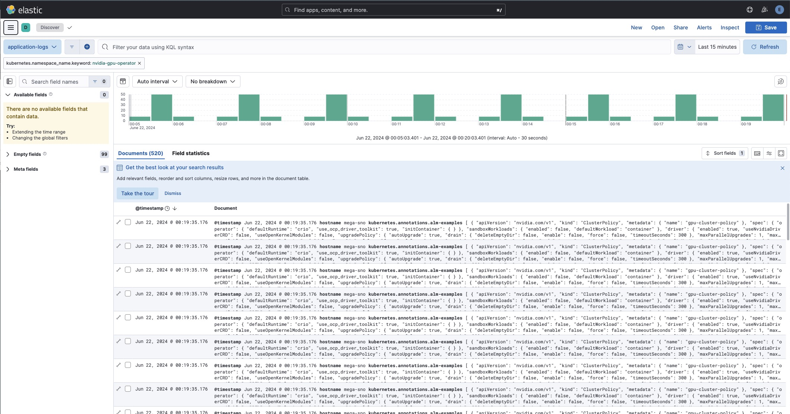

# OpenShift Logging - Forwarding to an External Elasticstack

A common practice is to have a centralized logging service such as Splunk, Elastic, etc.  This allows the forwarding of multiple services such as different OpenShift clusters to this central service.  Below you can find the configuration needed to deploy the OpenShift Logging Operator and configure it to forward logs to Elasticstack.

Additional documentation can be found here: https://docs.openshift.com/container-platform/4.15/observability/logging/log_collection_forwarding/configuring-log-forwarding.html#cluster-logging-collector-log-forward-es_configuring-log-forwarding

## Install the OpenShift Logging Operator

To configure logging you must first install the OpenShift Logging Operator.  This can be done via the Web UI and the Operator Hub, or by applying the following manifest objects:

```yaml
---
apiVersion: v1
kind: Namespace
metadata:
  name: openshift-logging
---
apiVersion: operators.coreos.com/v1
kind: OperatorGroup
metadata:
  name: openshift-logging
  namespace: openshift-logging
spec:
  upgradeStrategy: Default
---
apiVersion: operators.coreos.com/v1alpha1
kind: Subscription
metadata:
  labels:
    operators.coreos.com/cluster-logging.openshift-logging: ''
  name: cluster-logging
  namespace: openshift-logging
spec:
  channel: stable-5.9
  installPlanApproval: Automatic
  name: cluster-logging
  source: redhat-operators
  sourceNamespace: openshift-marketplace
```

## Create the Elastic Service User

- In Elastic, open the left hand navigation menu, select **Stack Management > Management**.
- Navigate to the **Security > Users** section
- Create a New User - you can either create a new Role with the Privileges needed to send logs on specific Indices or provide the user `superuser` privileges for quickly testing integration.

## Create the Secret for the Elastic Service User Credentials

Provide the Username/Password of that newly created User to be used by the OpenShift Logging Operator:

```yaml
---
kind: Secret
apiVersion: v1
metadata:
  name: elastic-secret
  namespace: openshift-logging
stringData:
  password: somePassword
  username: userHere
type: Opaque
```

If your Elastic service is accessed via TLS at an HTTPS endpoint, you can add a `ca-bundle.crt` key to the Secret for chain validation.  The example below simply skips TLS validation.

## Configure ClusterLogging CR

Create the ClusterLogging Custom Resource - this configures the logging stack, in the instances where they're being forwarded to an external service only the Collector (Vector) is needed to be deployed:

```yaml
---
apiVersion: logging.openshift.io/v1
kind: ClusterLogging
metadata:
  name: instance
  namespace: openshift-logging
spec:
  collection:
    type: vector
  managementState: Managed
```

## Configure ClusterLogForwarder CR

The Collector pods will not be deployed until the ClusterLogForwarder is created:

```yaml
---
apiVersion: logging.openshift.io/v1
kind: ClusterLogForwarder
metadata:
  name: instance
  namespace: openshift-logging
spec:
  inputs: # Custom inputs for specific namespaces can be provided here
    - application:
        namespaces:
          - my-awesome-app
      name: custom-app-logs
  outputs:
    - name: remote-elasticsearch
      type: elasticsearch
      url: 'https://normandy.kemo.labs:9200' # The elasticstack endpoint
      elasticsearch:
        version: 8 # set the version, either 6, 7, or 8
      secret:
        name: elastic-secret # the name of the credential created above
      tls:
        insecureSkipVerify: true # If TLS validation is needed, provide it via a `ca-bundle.crt` key in the elastic-secret Secret
  pipelines:
    - inputRefs:
        - audit # lots of logs of every action
        - infrastructure # namespaces that start with openshift-*
        - custom-app-logs # the defined input above
        #- application # this will send all non-system logs
      name: elastic-store
      outputRefs: # What named output(s) to send this pipeline to
        - remote-elasticsearch
```

> Once these manifest objects are created, you should see the Collector pods spin up in the `openshift-logging` Namespace and shortly after the logs should be available in Elastic...

